# Tasks: Hyper-V L1VH Support Implementation

**Feature ID**: 001  
**Feature Name**: Hyper-V L1VH (Level 1 Virtual Hardware) Support  
**Created**: 2025-09-03  
**Status**: Ready for Implementation  
**Implementation Plan**: [implementation-plan.md](./implementation-plan.md)  
**Feature Specification**: [feature-spec.md](./feature-spec.md)  

---

## Constitutional Pre-Flight Checklist ✅

**MANDATORY**: All constitutional gates must be verified before implementation begins.

### ✅ Simplicity Gate
- [x] **≤3 Go packages**: Implementation uses only 2 packages (converter + featuregate)
- [x] **No premature optimization**: Direct, minimal L1VH detection and fallback
- [x] **Complexity justified**: Zero complexity - simple feature gate + hypervisor detection

### ✅ Anti-Abstraction Gate  
- [x] **Framework trust**: Direct libvirt/QEMU integration, no wrapper layers
- [x] **Single model**: One hypervisor detection path, no parallel systems
- [x] **Existing patterns**: Uses established KubeVirt converter patterns

### ✅ Integration-First Gate
- [x] **Real environment testing**: L1VH cluster testing prioritized over mocks
- [x] **Contract-driven**: Clear contracts for hypervisor selection behavior
- [x] **Component boundaries**: Minimal change to converter, zero change to other components

### ✅ KubeVirt Razor Gate
- [x] **"Useful for Pods" principle**: No VM-specific APIs, transparent optimization
- [x] **No privileged capabilities**: Uses existing Kubernetes resource patterns
- [x] **Choreography pattern**: Components act independently on observed state

**🚨 CONSTITUTIONAL COMPLIANCE VERIFIED - PROCEED TO IMPLEMENTATION**

---

## Phase 1: Alpha Implementation Tasks

### Task Group 1: Test-First Development (CONSTITUTIONAL MANDATE)

**Priority**: CRITICAL - MUST BE COMPLETED BEFORE ANY IMPLEMENTATION CODE  
**Constitutional Requirement**: Article IV - Test-First Implementation  
**Estimation**: 2-3 days  

#### Task 1.1: Contract Tests 
**Owner**: [Assignee]  
**Status**: Not Started  
**Prerequisites**: Constitutional gates passed  
**Definition of Done**: All contract tests written, reviewed, and failing (Red phase of TDD)

**Deliverables**:
- [ ] **Contract Test**: Transparent hypervisor selection with feature gate enabled
  - File: `pkg/virt-launcher/virtwrap/converter/converter_test.go`
  - Test: `TestL1VHTransparentSelection`
  - Verifies: VM automatically uses `mshv` hypervisor when L1VH available + feature gate enabled

- [ ] **Contract Test**: QEMU/KVM fallback behavior
  - File: `pkg/virt-launcher/virtwrap/converter/converter_test.go`
  - Test: `TestL1VHFallbackToQEMU`  
  - Verifies: VM uses `qemu` hypervisor when L1VH unavailable or feature gate disabled

- [ ] **Contract Test**: Feature gate enforcement
  - File: `pkg/virt-config/featuregate/featuregate_test.go`
  - Test: `TestHyperVL1VHFeatureGate`
  - Verifies: Feature gate controls L1VH behavior cluster-wide

**Acceptance Criteria**:
- [ ] Tests clearly express transparency requirements from specification
- [ ] Tests validate fallback behavior without user intervention
- [ ] Tests confirm feature gate controls all L1VH functionality
- [ ] All tests are reviewed and approved by team
- [ ] Tests FAIL (confirming they test real behavior, not implementation)

#### Task 1.2: Integration Tests
**Owner**: [Assignee]  
**Status**: Not Started  
**Prerequisites**: Contract tests approved  
**Definition of Done**: Integration tests written covering component interactions

**Deliverables**:
- [ ] **Integration Test**: End-to-end VM lifecycle with transparent L1VH
  - File: `tests/hyperv_l1vh_test.go`
  - Test: `TestTransparentL1VHVMLifecycle`
  - Verifies: Standard VM creation results in L1VH optimization when available

- [ ] **Integration Test**: Feature gate enable/disable behavior
  - File: `tests/hyperv_l1vh_test.go`
  - Test: `TestL1VHFeatureGateToggle`
  - Verifies: Feature gate changes affect hypervisor selection immediately

- [ ] **Integration Test**: Mixed environment compatibility
  - File: `tests/hyperv_l1vh_test.go`
  - Test: `TestL1VHCompatibilityWithExistingFeatures`
  - Verifies: L1VH works alongside existing KubeVirt features transparently

**Acceptance Criteria**:
- [ ] Tests use real L1VH environment (Azure VMs with `/dev/mshv`)
- [ ] Tests verify transparent operation - no user configuration required
- [ ] Tests confirm existing VM specifications work without modification
- [ ] Integration tests are reviewed and approved
- [ ] Tests FAIL initially (Red phase of TDD)

#### Task 1.3: E2E Tests
**Owner**: [Assignee]  
**Status**: Not Started  
**Prerequisites**: Integration tests approved  
**Definition of Done**: Complete user workflow tests covering L1VH scenarios

**Deliverables**:
- [ ] **E2E Test**: Complete VM deployment workflow with L1VH cluster
  - File: `tests/e2e_hyperv_l1vh_test.go`
  - Test: `TestCompleteVMWorkflowWithL1VH`
  - Verifies: kubectl apply → VM creation → L1VH optimization → VM deletion

- [ ] **E2E Test**: Performance validation test framework
  - File: `tests/performance_l1vh_test.go`
  - Test: `TestL1VHPerformanceOptimization`
  - Verifies: L1VH provides measurable performance benefits

**Acceptance Criteria**:
- [ ] Tests represent real user workflows with standard VM specifications
- [ ] Tests validate performance improvements vs nested virtualization
- [ ] Tests confirm transparent operation across complete lifecycle
- [ ] E2E tests approved and initially failing

### Task Group 2: Minimal Implementation (POST-TDD ONLY)

**Priority**: HIGH  
**Prerequisites**: ALL TESTS WRITTEN, REVIEWED, AND APPROVED  
**Estimation**: 1-2 days  
**Constitutional Requirement**: Only after TDD Red phase completed

#### Task 2.1: Feature Gate Registration
**Owner**: [Assignee]  
**Status**: Not Started  
**Prerequisites**: Feature gate tests written and failing  
**Definition of Done**: `HyperVL1VH` feature gate registered and functional

**Deliverables**:
- [ ] **Feature Gate Implementation**
  - File: `pkg/virt-config/featuregate/feature-gates.go`
  - Add: `HyperVL1VH` constant and spec definition
  - Configuration: Alpha stage, default false

```go
const (
    HyperVL1VH featuregate.FeatureGate = "HyperVL1VH"
)

var defaultKubeVirtFeatureGates = map[featuregate.FeatureGate]featuregate.FeatureSpec{
    HyperVL1VH: {Stage: featuregate.Alpha, Default: false},
}
```

**Acceptance Criteria**:
- [ ] Feature gate properly registered in KubeVirt configuration
- [ ] Feature gate can be enabled/disabled via KubeVirt config
- [ ] Feature gate tests pass (Green phase of TDD)
- [ ] No existing functionality affected when feature gate disabled

#### Task 2.2: Transparent Hypervisor Detection
**Owner**: [Assignee]  
**Status**: Not Started  
**Prerequisites**: Converter tests written and failing  
**Definition of Done**: virt-launcher automatically selects L1VH when available

**Deliverables**:
- [ ] **Hypervisor Detection Logic**
  - File: `pkg/virt-launcher/virtwrap/converter/converter.go`
  - Function: Extend existing `detectHypervisorType` or similar
  - Behavior: Auto-detect L1VH capability and select optimal hypervisor

```go
func (c *ConverterContext) detectHypervisorType(vmi *v1.VirtualMachineInstance) (string, error) {
    // L1VH Auto-Detection (when feature gate enabled)
    if featuregate.DefaultFeatureGate.Enabled(featuregate.HyperVL1VH) {
        if c.hasL1VHSupport() {
            return "mshv", nil
        }
    }
    // Existing QEMU/KVM detection (unchanged)
    return c.detectQEMUKVMType(vmi)
}

func (c *ConverterContext) hasL1VHSupport() bool {
    _, err := os.Stat("/dev/mshv")
    return err == nil
}
```

**Acceptance Criteria**:
- [ ] L1VH automatically selected when feature gate enabled + `/dev/mshv` available
- [ ] Graceful fallback to QEMU/KVM when L1VH unavailable
- [ ] Zero impact on existing converter functionality
- [ ] Converter tests pass (Green phase of TDD)
- [ ] Implementation follows constitutional anti-abstraction principles

#### Task 2.3: Domain XML Integration
**Owner**: [Assignee]  
**Status**: Not Started  
**Prerequisites**: Hypervisor detection implemented and tested  
**Definition of Done**: libvirt domain XML properly configured for L1VH

**Deliverables**:
- [ ] **Domain Configuration for L1VH**
  - File: `pkg/virt-launcher/virtwrap/converter/converter.go`
  - Function: Extend `Convert_v1_VirtualMachineInstance_To_api_Domain`
  - Behavior: Configure domain for `mshv` hypervisor type

**Acceptance Criteria**:
- [ ] Domain XML properly configured for L1VH hypervisor
- [ ] Standard VM specifications work without modification
- [ ] L1VH-specific optimizations applied when appropriate
- [ ] All contract and integration tests pass

### Task Group 3: Documentation and Observability

**Priority**: MEDIUM  
**Prerequisites**: Core implementation complete and tested  
**Estimation**: 1 day  

#### Task 3.1: User Documentation
**Owner**: [Assignee]  
**Status**: Not Started  
**Prerequisites**: Implementation complete  
**Definition of Done**: Complete user-facing documentation

**Deliverables**:
- [ ] **L1VH Feature Documentation**
  - File: `docs/hyperv-l1vh.md`
  - Content: User guide for L1VH clusters, transparent operation explanation
  
- [ ] **Cluster Setup Guide**
  - File: `docs/hyperv-l1vh-cluster-setup.md`
  - Content: Requirements for L1VH-capable clusters (Azure VM requirements, etc.)

**Acceptance Criteria**:
- [ ] Documentation clearly explains transparent operation
- [ ] Setup requirements clearly documented
- [ ] Troubleshooting guidance provided
- [ ] Examples show standard VM specifications (no L1VH-specific config)

#### Task 3.2: Observability Integration
**Owner**: [Assignee]  
**Status**: Not Started  
**Prerequisites**: Core implementation complete  
**Definition of Done**: L1VH operation is observable

**Deliverables**:
- [ ] **Logging Integration**
  - Location: virt-launcher converter
  - Content: Log hypervisor selection decisions and L1VH availability

- [ ] **Optional Status Field**
  - Location: VM status conditions
  - Content: Optional field indicating L1VH optimization (for debugging)

**Acceptance Criteria**:
- [ ] Clear log messages for hypervisor selection
- [ ] Observable L1VH operation for troubleshooting
- [ ] Status information helps with cluster validation

---

## Task Dependencies

```mermaid
graph TD
    A[Constitutional Gates ✅] --> B[Contract Tests]
    B --> C[Integration Tests]
    C --> D[E2E Tests]
    D --> E[Feature Gate Implementation]
    E --> F[Hypervisor Detection]
    F --> G[Domain XML Integration]
    G --> H[Documentation]
    G --> I[Observability]
    H --> J[Alpha Release Ready]
    I --> J
```



## Task Assignments

**To be filled in by team:**
- **Contract Tests**: [Team Member 1]
- **Integration Tests**: [Team Member 2]  
- **E2E Tests**: [Team Member 3]
- **Feature Gate**: [Team Member 1]
- **Hypervisor Detection**: [Team Member 2]
- **Domain XML**: [Team Member 2]
- **Documentation**: [Team Member 3]
- **Observability**: [Team Member 1]

## Definition of Done - Alpha Release

### Functional Requirements ✅
- [ ] VMs automatically use L1VH when feature gate enabled and L1VH available
- [ ] VMs seamlessly fall back to QEMU/KVM when L1VH unavailable
- [ ] Standard VM specifications work without modification
- [ ] Feature gate controls L1VH behavior cluster-wide

### Quality Requirements ✅
- [ ] **Test Coverage**: All tests written first and passing (TDD Green phase)
- [ ] **Constitutional Compliance**: All constitutional gates verified
- [ ] **Performance**: L1VH performance benefits measured and documented
- [ ] **Documentation**: Complete user and setup documentation

### Non-Functional Requirements ✅
- [ ] **Zero Breaking Changes**: Existing functionality unaffected
- [ ] **Transparent Operation**: Users unaware of hypervisor selection complexity
- [ ] **Cluster-Wide Behavior**: All nodes assumed L1VH-capable when feature gate enabled
- [ ] **Graceful Degradation**: Clear behavior when L1VH requirements not met

## Risk Mitigation Tasks

### Constitutional Compliance Risk
- **Mitigation Task**: Regular constitutional review at each milestone
- **Owner**: [Technical Lead]
- **Frequency**: Before each task group completion

### L1VH Environment Availability
- **Mitigation Task**: Azure L1VH test cluster setup and validation
- **Owner**: [Infrastructure Team]
- **Prerequisites**: Before integration testing begins

### Performance Validation
- **Mitigation Task**: Baseline performance benchmarking framework
- **Owner**: [Performance Team]
- **Prerequisites**: Before E2E testing begins

---

## Next Steps

1. **Assign Tasks**: Fill in task assignments with team members
2. **Constitutional Review**: Validate all constitutional gates are met
3. **Test Environment**: Set up Azure L1VH test cluster
4. **Begin TDD**: Start with contract tests (Task 1.1)

**⚠️ CRITICAL**: No implementation code may be written until ALL tests are written, reviewed, and approved per KubeVirt Constitution Article IV.

---

*This task breakdown follows the KubeVirt Constitution v1.0 and implements spec-driven development with transparent Hyper-V L1VH support that maintains 100% backward compatibility while eliminating nested virtualization performance penalties.*
