# Tasks: Hyper-V L1VH Support Implementation

**Feature ID**: 001  
**Feature Name**: Hyper-V L1VH (Level 1 Virtual Hardware) Support  
**Created**: 2025-09-03  
**Status**: Ready for Implementation  
**Implementation Plan**: [implementation-plan.md](./implementation-plan.md)  
**Feature Specification**: [feature-spec.md](./feature-spec.md)  

---

## Constitutional Pre-Flight Checklist ✅

**MANDATORY**: All constitutional gates must be verified before implementation begins.

### ✅ Simplicity Gate
- [x] **≤3 Go packages**: Implementation uses only 2 packages (converter + featuregate)
- [x] **No premature optimization**: Direct, minimal L1VH detection and fallback
- [x] **Complexity justified**: Zero complexity - simple feature gate + hypervisor detection

### ✅ Anti-Abstraction Gate  
- [x] **Framework trust**: Direct libvirt/QEMU integration, no wrapper layers
- [x] **Single model**: One hypervisor detection path, no parallel systems
- [x] **Existing patterns**: Uses established KubeVirt converter patterns

### ✅ Integration-First Gate
- [x] **Real environment testing**: L1VH cluster testing prioritized over mocks
- [x] **Contract-driven**: Clear contracts for hypervisor selection behavior
- [x] **Component boundaries**: Minimal change to converter, zero change to other components

### ✅ KubeVirt Razor Gate
- [x] **"Useful for Pods" principle**: No VM-specific APIs, transparent optimization
- [x] **No privileged capabilities**: Uses existing Kubernetes resource patterns
- [x] **Choreography pattern**: Components act independently on observed state

### ✅ Security by Design Gate (Article XI)
- [x] **Trust model documented**: Clear boundaries between KubeVirt and underlying technologies
- [x] **Integration points identified**: All KubeVirt-controlled security touchpoints analyzed
- [x] **Security responsibilities scoped**: KubeVirt security limited to integration layer only
- [x] **Threat model complete**: Comprehensive analysis focusing on KubeVirt integration security
- [x] **Security testing strategy**: Security tests focused on integration points, not hypervisor security

### ✅ Observability Gate (Article XII)
- [x] **Metrics strategy defined**: Prometheus metrics for L1VH operations and performance
- [x] **Logging standards compliance**: Structured logging with correlation IDs
- [x] **Debug capabilities designed**: CLI tools and debug endpoints for troubleshooting
- [x] **Alerting and SLA definitions**: Operational alerts and performance SLA monitoring

**🚨 CONSTITUTIONAL COMPLIANCE VERIFIED - PROCEED TO IMPLEMENTATION**

---

## Phase 1: Alpha Implementation Tasks

### Task Group 0: Environment and Infrastructure Setup (PARALLEL DEVELOPMENT)

**Priority**: HIGH - CAN RUN IN PARALLEL WITH DEVELOPMENT  
**Estimation**: 1-2 days  
**Note**: Development can proceed with mocked L1VH environment while real environment is prepared

#### Task 0.1: L1VH Test Environment Setup
**Prerequisites**: Constitutional gates passed  
**Definition of Done**: L1VH-capable test environment ready for integration testing

**Deliverables**:
- [ ] **Azure L1VH Test Cluster Setup**
  - Environment: Azure VMs with L1VH capability enabled
  - Requirements: `/dev/mshv` device available on all nodes
  - Validation: `ls -la /dev/mshv` returns device file
  - Networking: Standard Kubernetes networking configured

- [ ] **Dependency Version Validation**
  - Task: Validate minimum libvirt version supports mshv driver
  - Task: Validate minimum QEMU version supports mshv backend  
  - Task: Document tested version combinations
  - Documentation: `docs/requirements/l1vh-dependencies.md`

**Acceptance Criteria**:
- [ ] L1VH test cluster deployed and accessible
- [ ] All dependency versions validated and documented
- [ ] Environment health checks automated
- [ ] Ready for integration testing (Task 1.2)

#### Task 0.2: Build System Integration
**Prerequisites**: None - can start immediately  
**Definition of Done**: Build system supports L1VH feature development

**Deliverables**:
- [ ] **Bazel Build Configuration**
  - File: `BUILD.bazel` files updated for L1VH feature flag
  - Configuration: Conditional compilation for L1VH-specific code
  - Testing: Build works with and without L1VH feature enabled

- [ ] **Container Image Validation** 
  - Task: Validate no additional container dependencies required
  - Task: Confirm L1VH works with existing virt-launcher images

**Acceptance Criteria**:
- [ ] Build system compiles L1VH feature correctly
- [ ] Feature flag controls compilation appropriately
- [ ] No additional container dependencies required

### Task Group 1: Test-First Development (CONSTITUTIONAL MANDATE)

**Priority**: CRITICAL - MUST BE COMPLETED BEFORE ANY IMPLEMENTATION CODE  
**Constitutional Requirement**: Article IV - Test-First Implementation  
**Estimation**: 1-2 days  
**Prerequisites**: None - can start immediately with mocked L1VH environment  

**Compatibility Testing Strategy**:
- **LEVERAGE EXISTING TESTS**: Since L1VH is transparent (no API changes), existing KubeVirt integration tests automatically validate L1VH compatibility when run on L1VH-enabled clusters
- **Automatic Coverage**: Standard VM specifications work identically with L1VH vs QEMU - existing tests should prove this

#### Task 1.1: Contract Tests 
**Prerequisites**: None - can start immediately  
**Definition of Done**: All contract tests written, reviewed, and failing (Red phase of TDD)

**Deliverables**:
- [ ] **Contract Test**: Transparent hypervisor selection with feature gate enabled
  - File: `pkg/virt-launcher/virtwrap/converter/converter_test.go`
  - Test: `TestL1VHTransparentSelection`
  - Verifies: virt-launcher automatically uses `mshv` hypervisor when L1VH available + feature gate enabled

- [ ] **Contract Test**: QEMU/KVM fallback behavior
  - File: `pkg/virt-launcher/virtwrap/converter/converter_test.go`
  - Test: `TestL1VHFallbackToKVM`  
  - Verifies: virt-launcher uses `kvm` hypervisor when L1VH unavailable or feature gate disabled

**Acceptance Criteria**:
- [ ] Tests clearly express transparency requirements from specification
- [ ] Tests validate fallback behavior without user intervention
- [ ] All tests are reviewed and approved by team
- [ ] Tests FAIL (confirming they test real behavior, not implementation)

#### Task 1.2: Integration Tests
**Prerequisites**: Contract tests approved  
**Definition of Done**: Validate existing integration tests work transparently with L1VH

**Testing Approach**: **RUN EXISTING TESTS** on L1VH cluster rather than creating duplicate tests

**Deliverables**:
- [ ] **Validate Existing Integration Tests with L1VH**: Run existing integration test suite on L1VH cluster
  - Tests: Existing VM lifecycle tests from `tests/`
  - Behavior: Tests pass identically with L1VH feature gate enabled vs disabled  
  - Validates: Standard VM specs work transparently with L1VH optimization

- [ ] **L1VH-Specific Integration Test**: Hypervisor selection validation
  - File: `tests/hyperv_l1vh_test.go`
  - Test: `TestL1VHTransparentHypervisorSelection`
  - Validates: L1VH automatically selected when available, fallback to KVM when not

**Acceptance Criteria**:
- [ ] **All existing integration tests pass identically** with L1VH feature gate enabled vs disabled
- [ ] Tests verify transparent operation - no user configuration required
- [ ] Tests use mocked L1VH environment for initial development, validate against real environment when available
- [ ] Tests FAIL initially (Red phase of TDD)

#### Task 1.3: E2E Tests
**Prerequisites**: Integration tests approved  
**Definition of Done**: Validate existing E2E workflows work transparently with L1VH

**Testing Approach**: **RUN EXISTING E2E TESTS** on L1VH cluster to validate transparent operation

**Deliverables**:
- [ ] **Validate Existing E2E Tests with L1VH**: Run existing E2E test suite on L1VH cluster
  - Tests: Existing VM workflow tests from `tests/`  
  - Behavior: All E2E tests pass identically with L1VH feature gate enabled vs disabled
  - Validates: Complete user workflows work transparently with L1VH optimization

**Acceptance Criteria**:
- [ ] **All existing E2E tests pass identically** with L1VH feature gate enabled vs disabled
- [ ] **User workflows unchanged** - kubectl apply → VM creation → VM deletion works transparently
- [ ] Tests validate transparent operation across complete VM lifecycle
- [ ] E2E tests initially failing (Red phase of TDD)

#### Task 1.4: Unit Tests
**Prerequisites**: Integration and E2E tests approved  
**Definition of Done**: Comprehensive unit test coverage for all L1VH components

**Deliverables**:
- [ ] **Feature Gate Unit Tests**
  - File: `pkg/virt-config/featuregate/feature-gates_test.go`
  - Test: `TestHyperVL1VHFeatureGateRegistration`
  - Verifies: Feature gate properly registered with correct default values
  - Test: `TestHyperVL1VHFeatureGateEnableDisable`
  - Verifies: Feature gate can be enabled/disabled programmatically

- [ ] **L1VH Detection Unit Tests**
  - File: `pkg/virt-launcher/virtwrap/converter/l1vh_test.go`
  - Test: `TestHasL1VHSupport_DeviceExists`
  - Verifies: Returns true when `/dev/mshv` device exists
  - Test: `TestHasL1VHSupport_DeviceMissing`
  - Verifies: Returns false when `/dev/mshv` device missing
  - Test: `TestHasL1VHSupport_DevicePermissions`
  - Verifies: Handles permission errors gracefully

- [ ] **Converter Logic Unit Tests**
  - File: `pkg/virt-launcher/virtwrap/converter/converter_test.go`
  - Test: `TestConvertL1VHEnabled_DeviceAvailable`
  - Verifies: Domain type configured for L1VH when feature gate enabled and device available
  - Test: `TestConvertL1VHEnabled_DeviceUnavailable`
  - Verifies: Fallback to KVM when feature gate enabled but device unavailable
  - Test: `TestConvertL1VHDisabled`
  - Verifies: Uses default KVM when feature gate disabled regardless of device availability

- [ ] **Edge Case Unit Tests**
  - File: `pkg/virt-launcher/virtwrap/converter/converter_test.go`
  - Test: `TestL1VHWithExistingKVMOverrides`
  - Verifies: L1VH detection respects existing KVM-specific configurations
  - Test: `TestL1VHWithEmulationMode`
  - Verifies: L1VH behavior when `AllowEmulation=true` is set

- [ ] **Memory Overhead Unit Tests** (NEW - CRITICAL)
  - File: `pkg/virt-controller/services/renderresources_test.go`
  - Test: `TestGetMemoryOverheadL1VH`
  - Verifies: Memory overhead calculations work correctly for mshv hypervisor type
  - Test: `TestL1VHMemoryOverheadVsKVM`
  - Verifies: L1VH overhead calculations vs KVM baseline (if different)
  - Test: `TestL1VHVFIOOverhead`
  - Verifies: Hardware passthrough overhead calculations for L1VH
  - Location: Extends existing overhead test coverage for mshv scenarios

**Acceptance Criteria**:
- [ ] **>90% code coverage** for all L1VH-specific functions
- [ ] Tests validate both positive and negative paths
- [ ] Edge cases covered with clear expected behaviors
- [ ] All tests FAIL initially (Red phase of TDD)
- [ ] Tests follow existing KubeVirt unit testing patterns

### Task Group 2: Minimal Implementation (POST-TDD ONLY)

**Priority**: HIGH  
**Prerequisites**: ALL TESTS WRITTEN, REVIEWED, AND APPROVED  
**Estimation**: 1-2 days  
**Constitutional Requirement**: Only after TDD Red phase completed

#### Task 2.1: Feature Gate Registration
**Prerequisites**: Feature gate tests written and failing  
**Definition of Done**: `HyperVL1VH` feature gate registered and functional

**Deliverables**:
- [ ] **Feature Gate Implementation**
  - File: `pkg/virt-config/featuregate/feature-gates.go`
  - Add: `HyperVL1VH` constant and spec definition
  - Configuration: Alpha stage, default false

```go
const (
    HyperVL1VH featuregate.FeatureGate = "HyperVL1VH"
)

var defaultKubeVirtFeatureGates = map[featuregate.FeatureGate]featuregate.FeatureSpec{
    HyperVL1VH: {Stage: featuregate.Alpha, Default: false},
}
```

**Acceptance Criteria**:
- [ ] Feature gate properly registered in KubeVirt configuration
- [ ] Feature gate can be enabled/disabled via KubeVirt config
- [ ] Feature gate tests pass (Green phase of TDD)
- [ ] No existing functionality affected when feature gate disabled

#### Task 2.2: Transparent Hypervisor Detection
**Prerequisites**: Converter tests written and failing  
**Definition of Done**: virt-launcher automatically selects L1VH when available

**Current System Analysis**:
- **Domain Type**: Currently defaults to `"kvm"` (set by api/defaults.go)
- **KVM Detection**: Converter checks `/dev/kvm` exists, sets `domain.Spec.Type = "qemu"` if missing and `AllowEmulation=true`
- **No Function Called**: There is NO existing `detectHypervisorType` or `detectQEMUKVMType` function

**Deliverables**:
- [ ] **L1VH Ensurer Logic**: Add L1VH Ensurer to existing converter flow
  - File: `pkg/virt-launcher/virtwrap/converter/converter.go` 
  - Location: In `Convert_v1_VirtualMachineInstance_To_api_Domain` function, after existing KVM check
  - Behavior: Ensure L1VH capability and override default "kvm" type

```go
// In Convert_v1_VirtualMachineInstance_To_api_Domain function, AFTER existing kvmPath check:

// Note: domain.Spec.Type remains "kvm" (default) if L1VH unavailable 
if featuregate.DefaultFeatureGate.Enabled(featuregate.HyperVL1VH) {
    if hasL1VHSupport() {
        // Update domain spec accordingly
    }
}

// L1VH Ensurer (when feature gate enabled)
func hasL1VHSupport() bool {
    // Simple validation may look like:
    _, err := os.Stat("/dev/mshv")
    return err == nil
}
```

**Acceptance Criteria**:
- [ ] Ensure L1VH capability suport when feature gate enabled + `/dev/mshv` available
- [ ] Graceful fallback to default "kvm" when L1VH unavailable  
- [ ] Zero impact on existing converter functionality (preserves existing KVM logic)
- [ ] Converter tests pass (Green phase of TDD)
- [ ] Implementation follows constitutional anti-abstraction principles

#### Task 2.3: Domain XML Integration
**Prerequisites**: Hypervisor detection implemented and tested  
**Definition of Done**: libvirt domain XML properly configured for L1VH hypervisor operation

**Deliverables**:
- [ ] **Research libvirt mshv Requirements**: Investigate actual domain XML requirements for mshv hypervisor
  - Task: Analyze libvirt mshv driver documentation and examples
  - Task: Identify required vs optional domain XML configurations for L1VH
  - Task: Document domain XML differences between kvm and mshv types
  - Output: `docs/l1vh-domain-xml-requirements.md`

- [ ] **Implement L1VH Domain Configuration**
  - File: `pkg/virt-launcher/virtwrap/converter/converter.go`
  - Function: Add `configureL1VHDomain` function following existing hypervisor-specific patterns
  - Integration: Call from `Convert_v1_VirtualMachineInstance_To_api_Domain` when `domain.Spec.Type = "mshv"`
  - Validation: Ensure configurations follow libvirt mshv driver requirements
  - Pattern: Follow existing HyperV feature configuration patterns in converter

**Acceptance Criteria**:
- [ ] Domain XML with required L1VH configurations accepted by libvirt without errors
- [ ] Standard VM specifications work with automatically applied L1VH domain configurations
- [ ] All contract and integration tests pass with mshv domain type and configurations

#### Task 2.4: Memory Overhead Research and Validation
**Prerequisites**: Domain XML integration complete  
**Definition of Done**: L1VH memory overhead characteristics researched and validated against existing KVM calculations

**Background**: Code analysis revealed extensive KVM-specific memory overhead calculations in `GetMemoryOverhead()` function that may need L1VH adaptation.

**Deliverables**:
- [ ] **L1VH Memory Overhead Research**
  - Task: Research mshv hypervisor memory overhead characteristics vs QEMU/KVM
  - Analysis: Compare process overhead for mshv vs virtqemud/qemu processes
  - Documentation: Document findings in `docs/l1vh-memory-overhead-analysis.md`
  - Key Questions: 
    - Does mshv have different process overhead than 220Mi QEMU/KVM baseline?
    - Are vCPU memory calculations (8Mi per vCPU) identical for mshv?
    - Does L1VH hardware passthrough use different overhead than 1Gi VFIO baseline?

- [ ] **Memory Overhead Validation Testing**
  - Environment: Deploy test VMs with both KVM and mshv backends
  - Measurement: Compare actual memory usage vs `GetMemoryOverhead()` calculations
  - Location: `pkg/virt-controller/services/renderresources.go:393-490`
  - Validation: Verify overhead accuracy for resource allocation

- [ ] **Overhead Calculation Adaptation** (conditional on research findings)
  - Implementation: Add L1VH-specific overhead logic if research shows differences
  - Pattern: Follow existing architecture-specific patterns (ARM64 example at line 449-452)
  - Integration: Modify `GetMemoryOverhead()` to account for hypervisor type when needed

**Acceptance Criteria**:
- [ ] L1VH memory overhead characteristics thoroughly researched and documented
- [ ] Actual L1VH memory usage validated against calculated overhead
- [ ] `GetMemoryOverhead()` function accuracy verified for mshv hypervisor
- [ ] Resource allocation accuracy maintained for L1VH VMs
- [ ] Any necessary overhead adaptations implemented and tested

#### Task 2.5: Process Memory Management Validation
**Prerequisites**: Memory overhead research complete  
**Definition of Done**: QEMU/kvm process memory management validated for L1VH compatibility

**Background**: Found QEMU/kvm-specific memory limit logic that may need mshv adaptation.

**Deliverables**:
- [ ] **QEMU/kvm Memory Limits Analysis**
  - Location: `pkg/virt-handler/isolation/detector.go:141-165`
  - Function: `AdjustQemuProcessMemoryLimits()` compatibility with mshv
  - Research: Determine if mshv uses similar memory limit mechanisms as virtqemud

- [ ] **L1VH Memory Management Testing**
  - Test: Validate memory limit enforcement works correctly with mshv backend
  - Integration: Ensure `AdjustQemuProcessMemoryLimits()` works or implement mshv equivalent
  - Validation: Memory limits properly enforced for L1VH VMs

**Acceptance Criteria**:
- [ ] Memory limit mechanisms validated for mshv hypervisor
- [ ] Process memory management works correctly with L1VH
- [ ] Any necessary adaptations implemented for mshv compatibility

### Task Group 3: Observability and Monitoring (CONSTITUTIONAL REQUIREMENT)

**Priority**: MEDIUM  
**Prerequisites**: Core implementation complete  
**Estimation**: 0.5 days  
**Constitutional Requirement**: Article XII - Observability Excellence

**Analysis**: **MOST MONITORING ALREADY ABSTRACTED** - libvirt domain stats API provides hypervisor-agnostic metrics for CPU, memory, storage, network. Only hypervisor selection and fallback metrics needed.

#### Task 3.1: Minimal L1VH-Specific Metrics
**Prerequisites**: Core implementation complete  
**Definition of Done**: Essential L1VH operational metrics implemented

**Deliverables**:
- [ ] **Hypervisor Selection Metrics** (ONLY metrics needed beyond existing monitoring)
  - File: `pkg/virt-launcher/virtwrap/converter/converter.go`
  - Metrics: 
    ```go
    kubevirt_vmi_hypervisor_type_total{hypervisor="mshv"}
    kubevirt_vmi_hypervisor_type_total{hypervisor="kvm"} 
    kubevirt_l1vh_fallback_total{reason="device_unavailable|feature_disabled"}
    ```
  - Integration: Add to existing hypervisor detection logic

**Acceptance Criteria**:
- [ ] Track hypervisor selection decisions for operational visibility
- [ ] Track fallback events for troubleshooting

#### Task 3.2: Enhanced Logging for L1VH Operations  
**Prerequisites**: Core implementation complete  
**Definition of Done**: Structured logging for L1VH hypervisor selection decisions

**Deliverables**:
- [ ] **L1VH Selection Decision Logging**
  - File: `pkg/virt-launcher/virtwrap/converter/converter.go`  
  - Enhancement: Log hypervisor selection decisions with structured fields
  - Events: L1VH device detection, hypervisor type selection, fallback triggers

**Acceptance Criteria**:
- [ ] **Leverage existing logging patterns** - Follow established converter logging practices
- [ ] JSON-structured logging with correlation IDs (existing pattern)
- [ ] Clear remediation guidance for L1VH fallback scenarios  
- [ ] **No duplicate logging** of existing domain creation events

### Task Group 4: Release Preparation

**Priority**: MEDIUM  
**Prerequisites**: Implementation and testing complete  
**Estimation**: 1 day  

#### Task 4.1: Release Documentation
**Prerequisites**: All implementation tasks complete  
**Definition of Done**: Complete documentation for alpha release

**Deliverables**:
- [ ] **User Documentation**
  - File: `docs/hyperv-l1vh.md`
  - Content: User guide for L1VH clusters, transparent operation explanation
  
- [ ] **Cluster Setup Guide**
  - File: `docs/hyperv-l1vh-cluster-setup.md`
  - Content: Requirements for L1VH-capable clusters (Azure VM requirements, etc.)

**Acceptance Criteria**:
- [ ] Documentation clearly explains transparent operation
- [ ] Setup requirements clearly documented with validation steps
- [ ] Examples show standard VM specifications (no L1VH-specific config)

---

## Task Dependencies

```mermaid
graph TD
    A[Constitutional Gates ✅] --> B[1.1: Contract Tests]
    A --> C[0.1: Environment Setup - PARALLEL]
    A --> D[0.2: Build System Integration - PARALLEL]
    B --> E[1.2: Integration Tests]
    E --> F[1.3: E2E Tests]
    F --> G[2.1: Feature Gate Implementation]
    G --> H[2.2: Hypervisor Detection]
    H --> I[2.3: Domain XML Integration]
    I --> I2[2.4: Memory Overhead Research - CRITICAL]
    I2 --> I3[2.5: Process Memory Management]
    I3 --> J[3.1: L1VH Metrics]
    J --> K[3.2: Enhanced Logging]
    K --> L[4.1: Release Documentation]
    L --> M[Alpha Release Ready]
    
    C --> E
    D --> B
```



## Definition of Done - Alpha Release

### Functional Requirements ✅
- [ ] VMs automatically use L1VH when feature gate enabled and L1VH available
- [ ] VMs seamlessly fall back to QEMU/KVM when L1VH unavailable
- [ ] Standard VM specifications work without modification
- [ ] Feature gate controls L1VH behavior cluster-wide

### Quality Requirements ✅
- [ ] **Test Coverage**: All tests written first and passing (TDD Green phase)
- [ ] **Constitutional Compliance**: All constitutional gates verified
- [ ] **Security Validation**: Security controls implemented and tested
- [ ] **Performance**: L1VH performance benefits measured and documented
- [ ] **Memory Accuracy**: L1VH memory overhead calculations validated and accurate (NEW)
- [ ] **Resource Allocation**: Cluster resource planning validated for L1VH workloads (NEW)
- [ ] **Observability**: Comprehensive metrics, logging, and alerting implemented
- [ ] **Documentation**: Complete user, security, and operational documentation

### Non-Functional Requirements ✅
- [ ] **Zero Breaking Changes**: Existing functionality unaffected
- [ ] **Transparent Operation**: Users unaware of hypervisor selection complexity
- [ ] **Cluster-Wide Behavior**: All nodes assumed L1VH-capable when feature gate enabled
- [ ] **Graceful Degradation**: Clear behavior when L1VH requirements not met

## Risk Mitigation Tasks

### Environment Setup Risk
- **Risk**: L1VH test environment delays integration testing
- **Mitigation**: Start with mocked environment, validate with real environment when ready
- **Fallback**: Alternative L1VH environment provision plan

### Dependency Validation Risk
- **Risk**: Unknown libvirt/QEMU version compatibility issues
- **Mitigation**: Task 0.2 validates dependencies in parallel with development
- **Fallback**: Documented minimum version requirements

### Memory Overhead Accuracy Risk (NEW - HIGH PRIORITY)
- **Risk**: L1VH memory overhead differs from KVM calculations, causing resource allocation issues
- **Impact**: Could cause VM scheduling failures, memory pressure, or cluster capacity miscalculation
- **Mitigation**: Task 2.4 validates overhead accuracy early in implementation
- **Fallback**: Conservative overhead estimation until accurate L1VH measurements available
- **Timeline**: Must complete before scaling testing to avoid resource allocation problems

### Process Memory Management Risk (NEW - MEDIUM PRIORITY)
- **Risk**: QEMU memory limit logic incompatible with mshv, causing VM stability issues
- **Impact**: Could cause memory-related VM crashes or poor performance
- **Mitigation**: Task 2.5 validates memory management compatibility
- **Fallback**: Implement mshv-specific memory management if needed

### Timeline Risk
- **Risk**: Sequential task dependencies could cause deadline slip
- **Mitigation**: Maximum parallel development with environment setup running alongside coding
- **Updated**: Memory research (2.4) can run in parallel with basic implementation
- **Monitoring**: Daily progress tracking via GitHub Issues

### Security Integration Risk
- **Mitigation**: Security considerations built into all tasks, not separate review
- **Frequency**: Continuous validation throughout development

### Performance Validation Risk
- **Mitigation**: Performance testing integrated into E2E tests
- **Timeline**: No separate performance phase, validated continuously
- **Updated**: Memory overhead validation ensures performance measurements are accurate

---

## Next Steps

1. **Create GitHub Issues**: Convert each task into a GitHub Issue for tracking and assignment
2. **Environment Setup**: Start Task 0.1 (L1VH environment) in parallel with development  
3. **Begin TDD**: Start Task 1.1 (Contract Tests) immediately with mocked L1VH environment
4. **Parallel Development**: Execute Tasks 0.2 (Build System) and 1.1 (Contract Tests) simultaneously
5. **Constitutional Review**: Validate all constitutional gates remain met throughout development

---

*This task breakdown follows the KubeVirt Constitution v1.0 and implements spec-driven development with transparent Hyper-V L1VH support that maintains 100% backward compatibility while eliminating nested virtualization performance penalties.*
