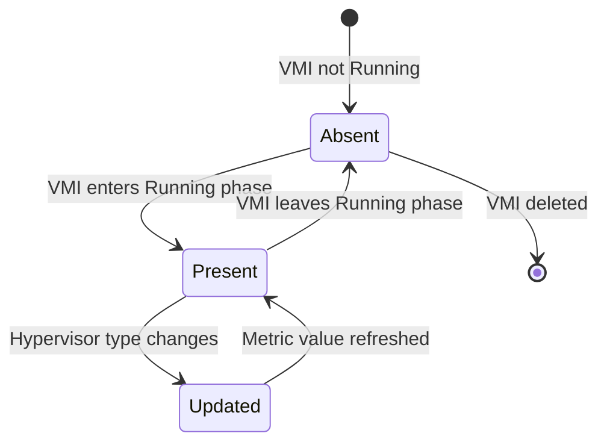

# Data Model: VMI Hypervisor Tracking Metric

**Generated**: October 13, 2025  
**Feature**: VMI Hypervisor Tracking Metric

## Metric Data Structure

### KubeVirt Metrics Framework Integration

**Framework**: Uses KubeVirt's `operatormetrics` package following established patterns in `pkg/monitoring/metrics/virt-handler/`

### Prometheus Metric Definition

```go
// Using KubeVirt's operator-observability-toolkit framework
var hypervisorInfoMetric = operatormetrics.NewInfoMetric(
    operatormetrics.MetricOpts{
        Name: "kubevirt_vmi_hypervisor_info",
        Help: "Information about the hypervisor type used by a VirtualMachineInstance",
    },
    []string{"namespace", "name", "node", "hypervisor_type"},
)
```

**Metric Output Format**:
```yaml
# HELP kubevirt_vmi_hypervisor_info Information about the hypervisor type used by a VirtualMachineInstance
# TYPE kubevirt_vmi_hypervisor_info info
kubevirt_vmi_hypervisor_info{namespace="default",name="my-vm",node="worker-node-1",hypervisor_type="kvm"} 1
```

### Label Schema

| Label | Type | Description | Values | Source |
|-------|------|-------------|--------|---------|
| `namespace` | string | VMI namespace | Kubernetes namespace | VMI.Namespace |
| `name` | string | VMI name | Kubernetes resource name | VMI.Name |
| `node` | string | Node name where VMI runs | Kubernetes node name | VMI.Status.NodeName |
| `hypervisor_type` | string | Detected hypervisor type | `kvm`, `qemu-tcg`, `unknown` | libvirt domain XML |

### Hypervisor Type Classification

```go
// HypervisorType represents the detected virtualization backend
type HypervisorType string

const (
    HypervisorTypeKVM     HypervisorType = "kvm"      // Hardware acceleration
    HypervisorTypeQEMUTCG HypervisorType = "qemu-tcg" // Software emulation  
    HypervisorTypeUnknown HypervisorType = "unknown"  // Cannot determine
)
```

### Detection Logic Mapping

```go
// libvirt Domain XML → hypervisor_type mapping
func detectHypervisorType(domainXML string) HypervisorType {
    // Parse: <domain type="kvm"> → "kvm"
    // Parse: <domain type="qemu"> → "qemu-tcg"  
    // Parse error/missing → "unknown"
}
```

## Metric Lifecycle

### State Transitions



### Lifecycle Events

| VMI Event | Metric Action | Trigger |
|-----------|---------------|---------|
| Phase → Running | Create metric | VMI informer event |
| Migration complete | Update metric | Post-migration event |
| Resume from pause | Update metric | VMI resume event |
| Phase → !Running | Remove metric | VMI informer event |
| VMI deleted | Remove metric | VMI deletion event |

## Internal Data Structures

### KubeVirt Metrics Framework Integration

```go
// Following established patterns in pkg/monitoring/metrics/virt-handler/
// Integration with existing SetupMetrics() function

// pkg/monitoring/metrics/virt-handler/hypervisor.go
var (
    hypervisorInfoMetric = operatormetrics.NewInfoMetric(
        operatormetrics.MetricOpts{
            Name: "kubevirt_vmi_hypervisor_info", 
            Help: "Information about the hypervisor type used by a VirtualMachineInstance",
        },
        []string{"namespace", "name", "node", "hypervisor_type"},
    )
)

// Register in metrics setup (follows existing pattern)
func SetupHypervisorMetrics() error {
    return operatormetrics.RegisterMetrics(hypervisorInfoMetric)
}
```

### Collector Integration Pattern

```go
// Following domainstats collector pattern
type HypervisorInfoCollector struct {
    vmiInformer cache.SharedIndexInformer
    // Reuse existing libvirt connections from domainstats
}

// Integration with existing collector registration
func RegisterHypervisorCollector(vmiInformer cache.SharedIndexInformer) error {
    collector := &HypervisorInfoCollector{
        vmiInformer: vmiInformer,
    }
    return operatormetrics.RegisterCollector(collector)
}
```

## Data Validation

### Input Validation

- **VMI Identity**: Validate namespace and name are non-empty
- **Node Assignment**: Ensure VMI has assigned node before metric creation
- **Domain Availability**: Handle libvirt domain not found gracefully

### Output Validation

- **Label Values**: Sanitize label values for Prometheus compatibility
- **Hypervisor Type**: Ensure only valid values (`kvm`, `qemu-tcg`, `unknown`)
- **Metric Consistency**: Prevent duplicate metrics for same VMI

## Error Handling

### Detection Failures

| Error Condition | Response | Metric Value |
|-----------------|----------|--------------|
| libvirt connection failure | Log error, retry | `hypervisor_type="unknown"` |
| Domain XML parse error | Log error | `hypervisor_type="unknown"` |
| Unsupported domain type | Log warning | `hypervisor_type="unknown"` |
| VMI without domain | Skip metric creation | (no metric) |

### Recovery Behavior

- **Transient Failures**: Retry on next VMI lifecycle event
- **Persistent Failures**: Emit metric with `unknown` value
- **Connection Recovery**: Re-detect on libvirt reconnection

## Performance Characteristics

### Memory Usage
- **Per-Metric**: ~200 bytes (labels + metadata)
- **Scale**: Linear with running VMI count
- **Cache**: ~100 bytes per cached VMI state

### CPU Usage
- **Detection**: ~1ms per libvirt XML query
- **Update Frequency**: Only on VMI lifecycle events
- **Overhead**: <0.1% per VMI transition

### Network Usage
- **Prometheus Scrape**: ~50 bytes per metric per scrape
- **libvirt Queries**: Local socket communication, minimal overhead

This data model provides the foundation for implementing the hypervisor tracking metric with proper state management, error handling, and performance characteristics.